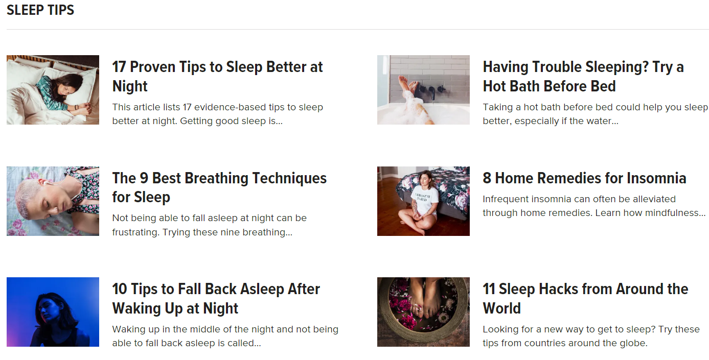
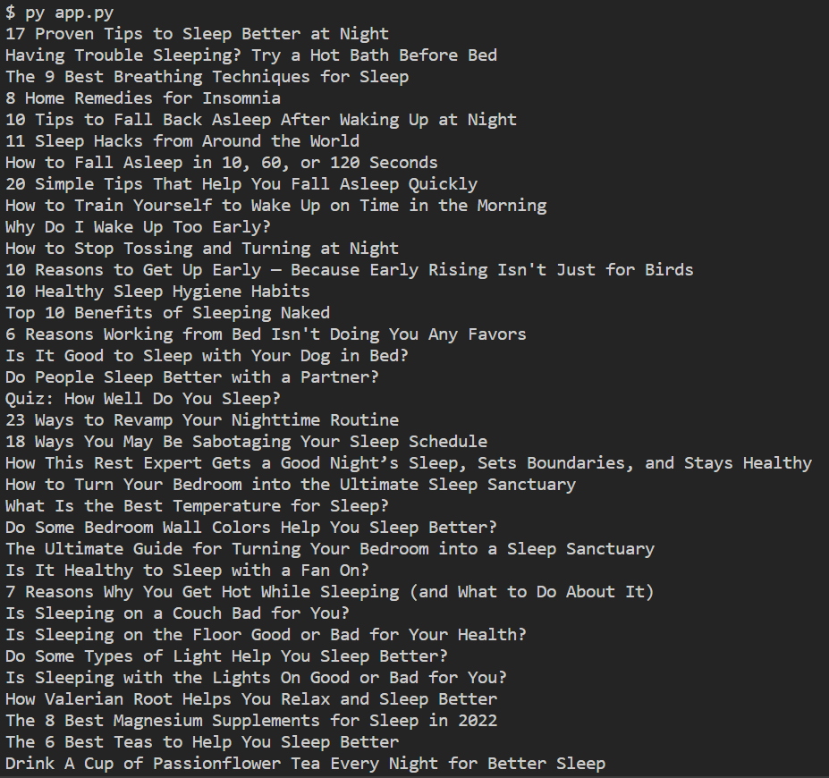

# Healthline-WebScraper

A webscraper written in Python based on Tomi Tokko's Web Scraper in "20 Beginner Python Projects." 

## Screenshot of https://www.healthline.com/sleep/routines

## Compilation & Usage
$ py app.py

## Sample output

